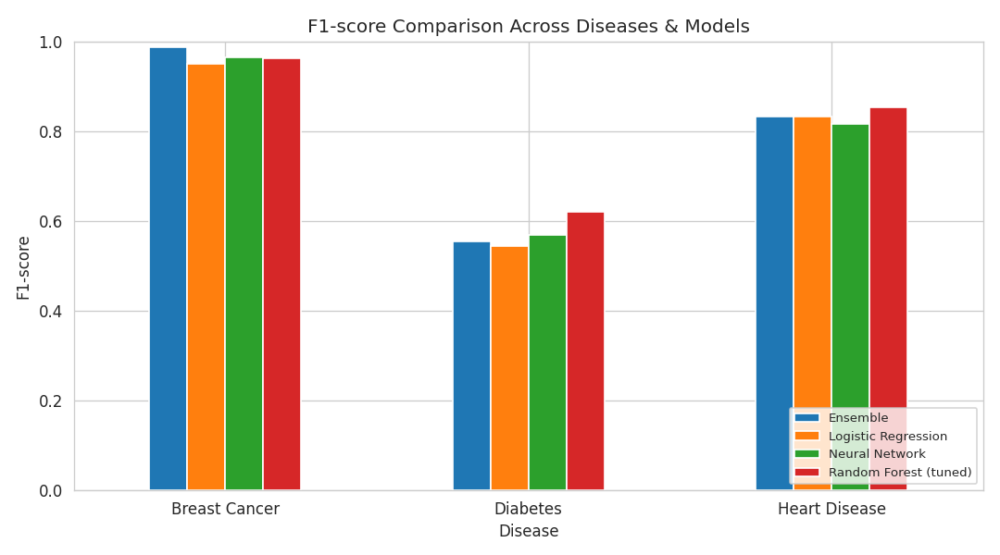
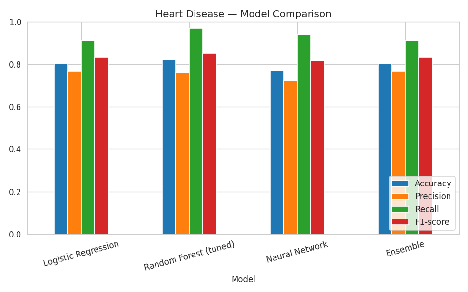
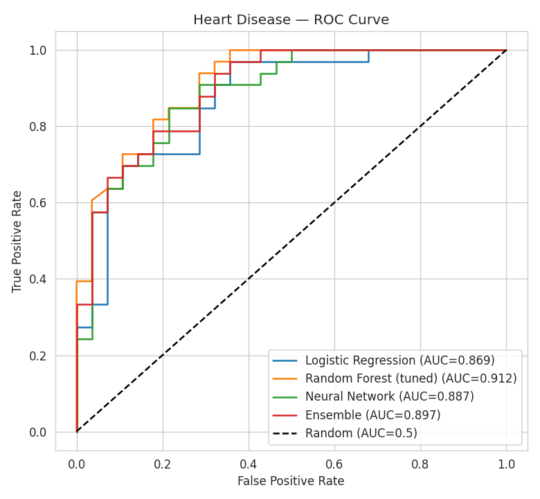
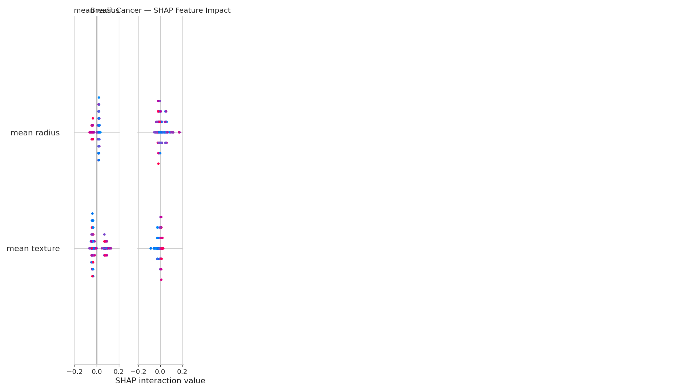

# 🩺 MediScan AI
### A Multi-Disease Risk Assessment Platform — Supervised + Unsupervised + Deep Learning, Unified

[](https://www.python.org/)
[](https://scikit-learn.org/)
[](https://www.tensorflow.org/)
[](https://streamlit.io/)
[](LICENSE)

## 📋 Overview

MediScan AI is a single, **reusable machine learning pipeline** applied across **three independent
healthcare datasets** — Diabetes, Heart Disease, and Breast Cancer — combined with a live, interactive
web app for real-time risk prediction. Instead of writing separate one-off notebook code per dataset,
this project builds the pipeline **once** as proper Python modules, and proves it generalizes by running
it on three genuinely different medical problems.

It demonstrates all three core ML paradigms from the training course, including a deep-learning
technique on the *unsupervised* side that most introductory projects skip entirely:

| Stage | Technique |
|---|---|
| Unsupervised Learning | KMeans clustering — cluster count chosen automatically via silhouette score |
| Deep Learning (Unsupervised) | **Autoencoder** — neural-network-based anomaly detection for unusual patient profiles |
| Supervised Learning | Logistic Regression + Random Forest, hyperparameter-tuned with `GridSearchCV` |
| Deep Learning (Supervised) | Keras Neural Network with Dropout + EarlyStopping |
| Ensemble | Soft-voting classifier combining the above |
| Evaluation | 5-fold cross-validation, ROC/AUC, confusion matrices |
| Explainability | SHAP values on the tuned Random Forest |
| Product | **Live Streamlit dashboard** — interactive sliders, real-time predictions, anomaly flags |

## 🖥️ The App

Run `streamlit run app/streamlit_app.py` and you get a 3-tab dashboard:

- **🔮 Predict** — pick a disease, move sliders for a patient's health values, and see live risk
  probabilities from all 4 models simultaneously, plus an autoencoder-based "unusual profile" warning
  and a plain-English explanation of the top contributing factors.
- **📊 Model Insights** — performance metrics, ROC curves, SHAP explainability, and cross-validation
  results for the selected disease.
- **🧬 Patient Subtypes & Anomalies** — shows the unsupervised clustering results and how the
  autoencoder's anomaly detection works.

This turns the project from "a notebook with some numbers" into something you can actually demo live.

## 🗂️ Project Structure

```
mediscan-ai/
├── app/
│   └── streamlit_app.py         # Interactive web dashboard
├── src/
│   ├── config.py                # Disease definitions: data loaders + UI feature ranges
│   ├── pipeline.py               # The ONE reusable ML pipeline (used by all 3 diseases)
│   └── train_all.py              # Trains all 3 pipelines, saves models + figures
├── notebooks/
│   └── MultiDisease_Analysis.ipynb   # Exploratory analysis & cross-disease comparison
├── data/
│   ├── diabetes.csv
│   └── heart.csv                 # (Breast Cancer is loaded directly from scikit-learn)
├── models/                       # Saved trained models per disease (generated by train_all.py)
│   ├── diabetes/
│   ├── heart/
│   └── breast_cancer/
├── images/                      # Exported comparison charts (used in this README)
├── results_comparison.csv       # Combined metrics across all diseases & models
├── requirements.txt
└── README.md
```

## 📊 Results Summary

| Disease | Model | Accuracy | Precision | Recall | F1-score |
|---|---|---|---|---|---|
| Diabetes | Random Forest (tuned) | 0.747 | 0.653 | 0.593 | **0.621** |
| Heart Disease | Random Forest (tuned) | 0.820 | 0.762 | 0.970 | **0.853** |
| Breast Cancer | Ensemble | 0.991 | 1.000 | 0.976 | **0.988** |

> Full per-model breakdown for every disease is in `results_comparison.csv` and the notebook.

### Cross-Disease F1-score Comparison


### Example: Heart Disease — Model Comparison & ROC
<table><tr>
<td></td>
<td></td>
</tr></table>

### Example: Breast Cancer — SHAP Explainability


## 🔍 Key Findings

- **The pipeline generalizes.** The exact same code trained strong, well-validated models across three
  completely different diseases — this is a stronger engineering claim than tuning one model to one dataset.
- **Deep learning earns its place on both sides.** A Keras classifier handles supervised prediction,
  while a separate **autoencoder** handles unsupervised anomaly detection — most student projects only
  show deep learning once, on the supervised side.
- **Nothing was guessed.** Cluster count (silhouette score), Random Forest hyperparameters
  (GridSearchCV + 5-fold CV), and neural network training length (EarlyStopping) were all chosen by the
  data itself, not picked arbitrarily.
- **Explainability is built in, not bolted on.** Every disease's predictions can be traced back to SHAP
  values showing which features drove them — important for any healthcare-adjacent model.
- **It's a usable tool, not just an analysis.** The trained models power a live Streamlit app — anyone
  can move sliders and get an instant, explained risk assessment.

## ▶️ How to Run

```bash
# 1. Clone the repo
git clone <your-repo-url>
cd mediscan-ai

# 2. Install dependencies
pip install -r requirements.txt

# 3. Train all 3 disease pipelines (creates models/ and images/)
python src/train_all.py

# 4. Launch the interactive app
streamlit run app/streamlit_app.py

# (Optional) Explore the analysis notebook
jupyter notebook notebooks/MultiDisease_Analysis.ipynb
```

## 🛠️ Tech Stack

`Python` · `pandas` · `NumPy` · `scikit-learn` · `TensorFlow / Keras` · `SHAP` · `Streamlit` · `Matplotlib` · `Seaborn`

## 🚀 Future Improvements

- Add SMOTE to address class imbalance on the harder datasets (diabetes, heart disease)
- Deploy the Streamlit app publicly (Streamlit Community Cloud) for a shareable live demo link
- Add a 4th disease dataset to further stress-test pipeline generalization
- Generate true per-patient SHAP force plots inside the app (currently uses global feature importance for speed)

## 👤 Author

Built as part of an AI/ML training project covering Supervised Learning, Unsupervised Learning, and
Deep Learning fundamentals — extended into a multi-disease platform with a live interactive demo.

## 📄 License

This project is licensed under the MIT License — see [LICENSE](LICENSE) for details.
